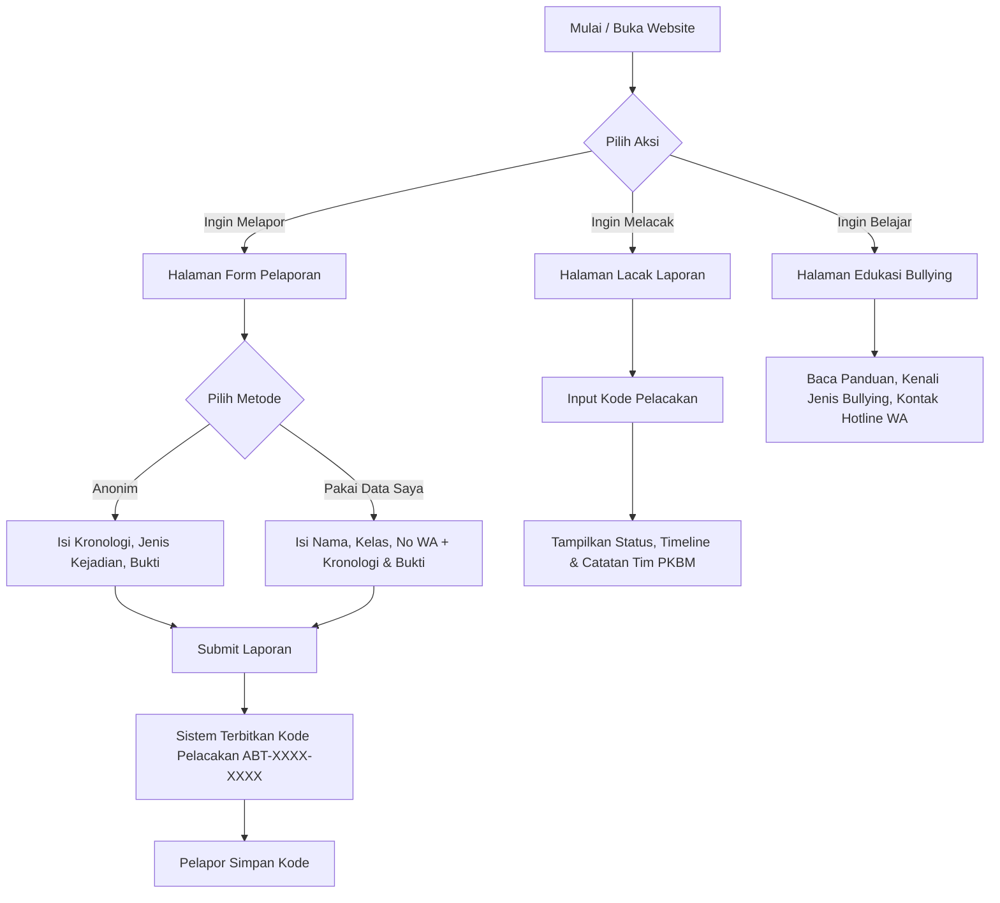

# Product Requirement Document (PRD) & Spesifikasi Sistem
## Sistem Informasi Pelaporan & Edukasi Perundungan PKBM Pintar Berbakat (Lapor Aman)

---

## 1. Latar Belakang & Tujuan
Pusat Kegiatan Belajar Masyarakat (PKBM) mewadahi peserta didik (warga belajar) dari berbagai latar belakang usia dan kondisi sosial (Paket A, Paket B, Paket C). Rasa aman dan bebas dari perundungan (bullying) baik fisik, verbal, sosial, maupun cyberbullying merupakan hak mendasar setiap peserta didik.

Seringkali korban atau saksi merasa enggan/takut melapor karena khawatir identitasnya terbongkar, diintimidasi lebih lanjut, atau merasa laporannya tidak akan ditindaklanjuti.

**Tujuan Sistem:**
1. Menyediakan saluran pelaporan yang **100% aman dan rahasia**, mendukung pelaporan **Anonim** maupun **Dengan Data Diri**.
2. Memberikan transparansi proses penanganan melalui **Kode Pelacakan Unik** (`ABT-XXXX-XXXX`) sehingga pelapor dapat memantau status secara mandiri.
3. Memberikan **Materi Edukasi Komprehensif** mengenai jenis perundungan, tanda-tanda, langkah penanganan korban, dan panduan saksi.
4. Memudahkan pengelola/tutor PKBM Pintar Berbakat dalam mendokumentasikan, meninjau, dan menindaklanjuti setiap insiden secara terstruktur.

---

## 2. Target Pengguna (User Persona)

| Persona | Peran | Kebutuhan Utama |
| :--- | :--- | :--- |
| **Warga Belajar (Korban/Saksi Anonim)** | Melaporkan kejadian tanpa ingin identitasnya diketahui siapapun. | Formulir cepat tanpa isian identitas wajib, proteksi privasi, dan kode pelacakan. |
| **Warga Belajar / Orang Tua (Dengan Data Diri)** | Melaporkan insiden dengan harapan dapat dihubungi langsung oleh tim penanganan. | Formulir dengan data diri (Nama, Kelas, No. WhatsApp), pembaruan status berkala. |
| **Tutor / Tim Penanganan PKBM** | Menerima laporan, memverifikasi bukti, menindaklanjuti, dan memperbarui status laporan. | Dashboard rekapitulasi, detail kronologi & berkas bukti, form update status & catatan. |

---

## 3. Alur Pengguna (User Workflow)

---

## 4. Spesifikasi Fungsional

### 4.1 Modul Pelaporan (Form Laporan)
- **Pemilihan Metode Interaktif:**
  - Opsi *Anonim*: Tanpa input identitas apapun.
  - Opsi *Pakai Data Saya*: Menampilkan input `Nama Lengkap`, dropdown `Kelas` (Paket A, Paket B, Paket C, dll), dan `No. WhatsApp`.
- **Informasi Insiden:**
  - Dropdown `Jenis Kejadian`: Fisik, Verbal, Sosial, Online (Cyberbullying), Lainnya.
  - Textarea `Kronologi Kejadian` (Wajib diisi, minimal 10 karakter).
  - Input `Tanggal Kejadian` (Opsional, format tanggal).
  - Input `Lokasi Kejadian` (Opsional, contoh: "Ruang Kelas Paket B").
  - Input `Siapa yang Terlibat` (Opsional, nama/ciri-ciri pihak yang terlibat).
  - Input `Bukti Pendukung` (Opsional, maksimal 5 berkas, maksimal 1 MB per berkas, format: `.jpg`, `.jpeg`, `.png`, `.webp`, `.pdf`).
- **Penerbitan Kode:**
  - Kode unik dibuat secara otomatis dengan format acak yang mudah dibaca: `ABT-XXXX-XXXX` (kombinasi alfanumerik huruf kapital dan angka).
  - Halaman konfirmasi sukses dengan instruksi jelas dan tombol "Salin Kode" serta tombol "Lacak Sekarang".

### 4.2 Modul Pelacakan (`/lacak`)
- Input kode pelacakan dengan validasi format.
- Menampilkan kartu rincian status:
  - Badge Status: `Menunggu Verifikasi`, `Sedang Ditinjau`, `Sedang Ditindaklanjuti`, `Selesai`, atau `Ditolak`.
  - Tanggal & waktu pelaporan.
  - Jenis insiden.
  - Timeline histori penanganan beserta catatan resmi dari Tim PKBM Pintar Berbakat.
  - Tombol bantuan langsung via WhatsApp bila dalam situasi mendesak.

### 4.3 Modul Edukasi (`/edukasi`)
- Memuat konten literasi pencegahan perundungan:
  1. Definisi Perundungan.
  2. 4 Jenis Perundungan (Fisik, Verbal, Sosial, Online).
  3. Tanda-tanda seseorang mengalami perundungan.
  4. 6 Langkah yang harus dilakukan jika menjadi korban.
  5. 4 Langkah bijak jika menjadi saksi (bystander).
  6. Call to action pelaporan dan nomor darurat Tim PKBM Pintar Berbakat (`https://wa.me/6282219082518`).

### 4.4 Modul Manajemen Pengelola PKBM (`/admin/laporan`)
- Menampilkan daftar seluruh laporan masuk.
- Filter berdasarkan status penanganan dan jenis pelapor (Anonim / Data Pribadi).
- Tampilan detail kronologi, informasi pelapor (jika non-anonim), dan berkas bukti lampiran.
- Aksi update status dan input catatan tindak lanjut.

---

## 5. Kebutuhan Non-Fungsional & Keamanan
- **Kerahasiaan Data (Data Privacy):** Laporan anonim tidak menyimpan data identitas pelapor dalam kolom data diri.
- **Keamanan Berkas:** Validasi ketat MIME type berkas lampiran untuk mencegah upload script berbahaya. Berkas tersimpan di penyimpanan terlindungi.
- **Aksesibilitas & Kerapian UI:** Desain antarmuka bersih, ramah, responsif di seluruh layar ponsel pintar maupun desktop, menggunakan palet warna menenangkan (calm slate / teal / indigo).
