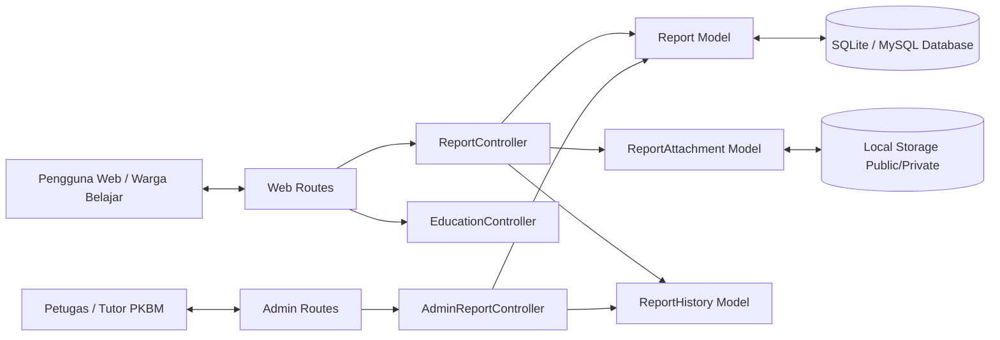
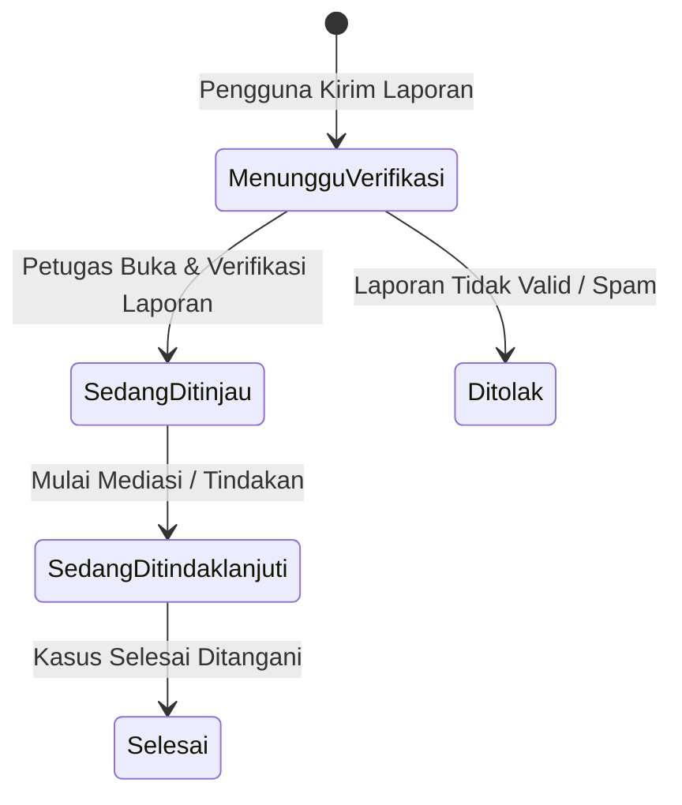

# Arsitektur Sistem & Desain Basis Data
## Sistem Informasi Pelaporan & Edukasi Perundungan PKBM Pintar Berbakat

---

## 1. Arsitektur Perangkat Lunak

Sistem dibangun dengan pola arsitektur **Model-View-Controller (MVC)** menggunakan **Laravel 12** pada lingkungan **PHP 8.5** dan frontend **Tailwind CSS 4 + Blade Templates**.

---

## 2. Skema & Struktur Tabel Database

### 2.1 Tabel `reports` (Laporan Kasus)
Menyimpan data utama laporan yang dikirimkan oleh pengguna.

| Kolom | Tipe Data | Keterangan |
| :--- | :--- | :--- |
| `id` | BIGINT (PK, Auto Inc) | Identifier unik laporan |
| `tracking_code` | VARCHAR(30) (UNIQUE, INDEX) | Kode pelacakan publik (misal: `ABT-7X9K-2M8P`) |
| `is_anonymous` | BOOLEAN | `true` jika anonim, `false` jika dengan data diri |
| `reporter_name` | VARCHAR(150) (NULLABLE) | Nama pelapor (jika non-anonim) |
| `reporter_class` | VARCHAR(50) (NULLABLE) | Kelas/Paket belajar (jika non-anonim) |
| `reporter_phone` | VARCHAR(30) (NULLABLE) | No. WhatsApp aktif (jika non-anonim) |
| `incident_type` | VARCHAR(50) | Jenis kejadian (`fisik`, `verbal`, `sosial`, `online`, `lainnya`) |
| `chronology` | TEXT | Deskripsi detail kronologi kejadian |
| `incident_date` | DATE (NULLABLE) | Tanggal insiden terjadi |
| `incident_location` | VARCHAR(150) (NULLABLE) | Lokasi terjadinya perundungan |
| `parties_involved` | VARCHAR(255) (NULLABLE) | Pihak yang diduga terlibat/ciri-cirinya |
| `status` | ENUM / VARCHAR(30) | `pending` (Menunggu Verifikasi), `reviewing` (Ditinjau), `investigating` (Ditindaklanjuti), `resolved` (Selesai), `rejected` (Ditolak) |
| `admin_notes` | TEXT (NULLABLE) | Catatan tindak lanjut terkini dari tim PKBM |
| `created_at` | TIMESTAMP | Waktu pembuatan |
| `updated_at` | TIMESTAMP | Waktu modifikasi terakhir |

### 2.2 Tabel `report_attachments` (Berkas Bukti Lampiran)
Menyimpan informasi berkas lampiran (foto/dokumen) yang diunggah pelapor.

| Kolom | Tipe Data | Keterangan |
| :--- | :--- | :--- |
| `id` | BIGINT (PK, Auto Inc) | Identifier berkas |
| `report_id` | BIGINT (FK -> `reports.id`) | Relasi ke laporan terkait (Cascade on delete) |
| `file_path` | VARCHAR(255) | Lokasi penyimpanan berkas di storage |
| `file_name` | VARCHAR(255) | Nama asli berkas |
| `file_size` | INTEGER | Ukuran berkas dalam bytes |
| `mime_type` | VARCHAR(100) | MIME type berkas (e.g. `image/jpeg`, `application/pdf`) |
| `created_at` | TIMESTAMP | Waktu upload |
| `updated_at` | TIMESTAMP | Waktu modifikasi |

### 2.3 Tabel `report_histories` (Riwayat Perubahan Status)
Mencatat jejak perubahan status dan log catatan setiap kali laporan diproses oleh tim PKBM.

| Kolom | Tipe Data | Keterangan |
| :--- | :--- | :--- |
| `id` | BIGINT (PK, Auto Inc) | Identifier log |
| `report_id` | BIGINT (FK -> `reports.id`) | Relasi ke laporan terkait |
| `status` | VARCHAR(30) | Status saat perubahan terjadi |
| `note` | TEXT (NULLABLE) | Catatan penanganan pada tahap tersebut |
| `changed_by` | VARCHAR(100) (NULLABLE) | Nama petugas / sistem |
| `created_at` | TIMESTAMP | Waktu pencatatan log |
| `updated_at` | TIMESTAMP | Waktu modifikasi |

---

## 3. Relasi Antar Model Eloquent

- **Model `Report`**:
  - `hasMany(ReportAttachment::class)`
  - `hasMany(ReportHistory::class)`
- **Model `ReportAttachment`**:
  - `belongsTo(Report::class)`
- **Model `ReportHistory`**:
  - `belongsTo(Report::class)`

---

## 4. State Machine Status Laporan

